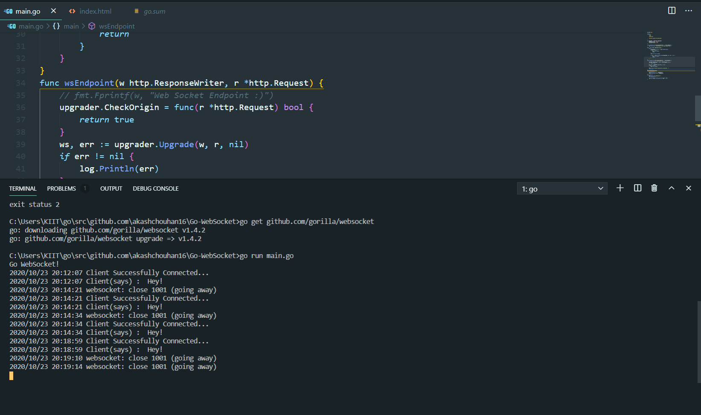

## Go-CLI-Sockets

---

**Test repo**

A test repo for Go lang web Socket.
[Go](https://golang.org/ "visit url") Implementation of the WebSocket protocol.

### Installation

```
go get github.com/gorilla/websocket
```

#### Imports for socket communication :

```go
import (
   "fmt"
	"log"
	"net/http"
    "github.com/gorilla/websocket"
)
```

Command Line test responses

